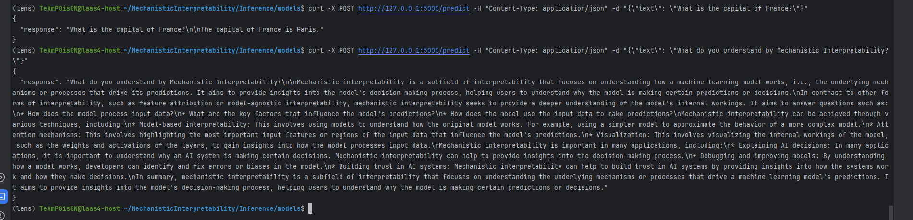

# Description

This project focuses on leveraging the LLaMA model for advanced natural language processing tasks. It includes a 
Flask-based API for processing and interpreting text inputs using the LLaMA model, with a focus on generating 
meaningful and contextually relevant responses.

## Features 

- RESTful API for text processing using Flask.
- Integration with LLaMA model for natural language understanding and generation.
- Support for handling multiple text inputs in a single request. #todo

##Usage

1. Download the Llama 2 model.
2. Convert the weights of the model to the Hugging Face format:
```
python3 convert_llama_weights_to_hf.py --input_dir <your downloaded directory> --model_size 7B --output_dir models
```

3. After converting run `model.py` to check if you are able to load model successfully or not.
```
(lens) TeAmP0is0N@laas4-host:~/MechanisticInterpretability/Inference/models$ python3 model.py ./models
Loading checkpoint shards: 100%|██████████████████████████████████████████████████████████████████████████████████████████████████████████████████████████████████████████████████████████████████████| 3/3 [00:10<00:00,  3.33s/it]
Model and tokenizer loaded successfully.
```

4. Start the Flask Server: 
```
python3 path/to/api_setup.py
```
Replace `path/to/api_setup.py` with the path to the Flask application file.

5. Making a Request 
- Use a tool like `curl`, Postman, or a Python script to make POST requests to `http://127.0.0.1:5000/predict`.
Example using `curl`:
```
curl -X POST http://127.0.0.1:5000/predict -H "Content-Type: application/json" -d "{\"text\": \"Your input text here\"}"
```

Demo is as follows:




